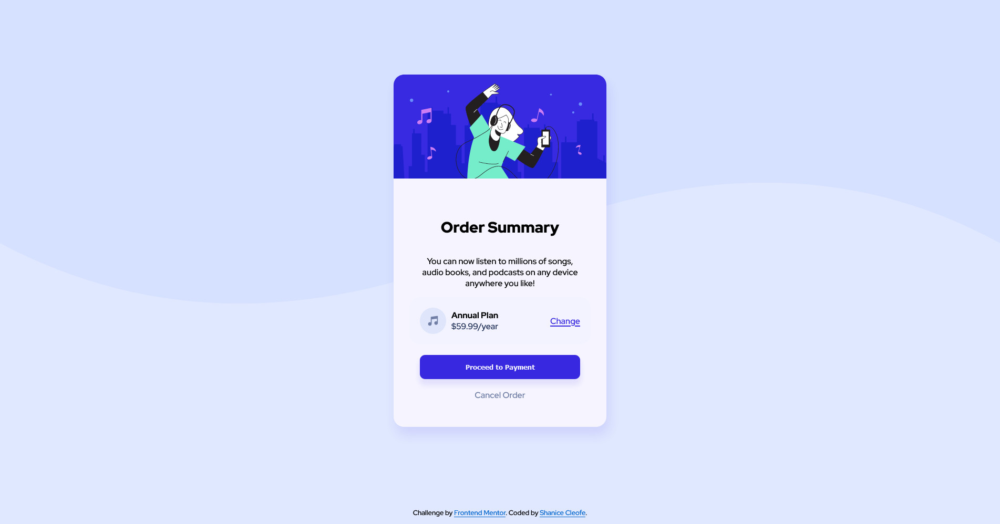

# Frontend Mentor - Order summary card solution

This is a solution to the [Order summary card challenge on Frontend Mentor](https://www.frontendmentor.io/challenges/order-summary-component-QlPmajDUj). Frontend Mentor challenges help you improve your coding skills by building realistic projects.

## Table of contents

- [Overview](#overview)
  - [The challenge](#the-challenge)
  - [Screenshot](#screenshot)
  - [Links](#links)
- [My process](#my-process)
  - [Built with](#built-with)
  - [What I learned](#what-i-learned)
  - [Useful resources](#useful-resources)
- [Author](#author)
- [Acknowledgments](#acknowledgments)

## Overview

### The challenge

Users should be able to:

- See hover states for interactive elements

### Screenshot

## Desktop Preview

---

## Desktop Preview States

---

## Mobile Preview

---

## Mobile Preview States

---

### Links

- Solution URL: [Solution](https://www.frontendmentor.io/solutions/order-summary-component-GDF7426hgp)
- Live Site URL: [Order Summary Layout](https://sdacleofe.github.io/order-summary-component-main/)

## My process

### Built with

- Semantic HTML5 markup
- CSS custom properties
- FlexBox
- StyleLint

### What I learned

Refining my understanding of how to use max-width, width, and the FlexBox layout.

### Useful resources

- [ChatGPT](https://www.example.com) - This helped me for finding answers to my questions. I really liked this pattern and will use it going forward.
- [Semantic HTML: What It Is and How to Use It Correctly](https://www.semrush.com/blog/semantic-html5-guide/) - This is an amazing article which helped me finally understand the meaning and structure of web content. I'd recommend it to anyone still learning this concept.

## Author

- Website - [Shanice Dawn](https://sdacleofe.github.io/about-me/)
- Frontend Mentor - [@sdacleofe](https://www.frontendmentor.io/profile/sdacleofe)
